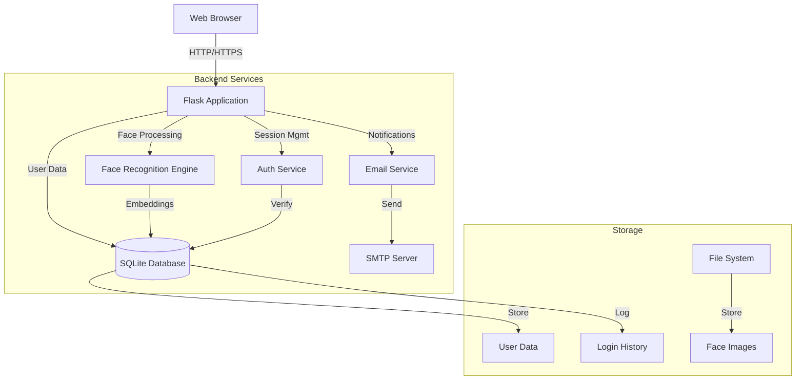
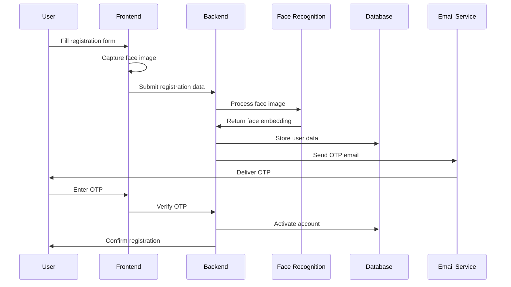
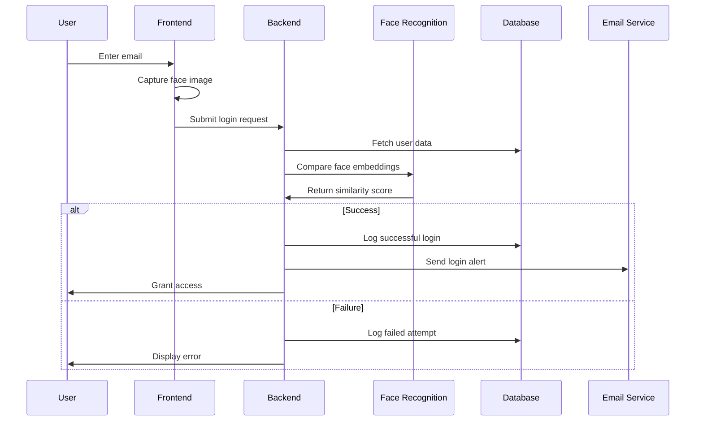
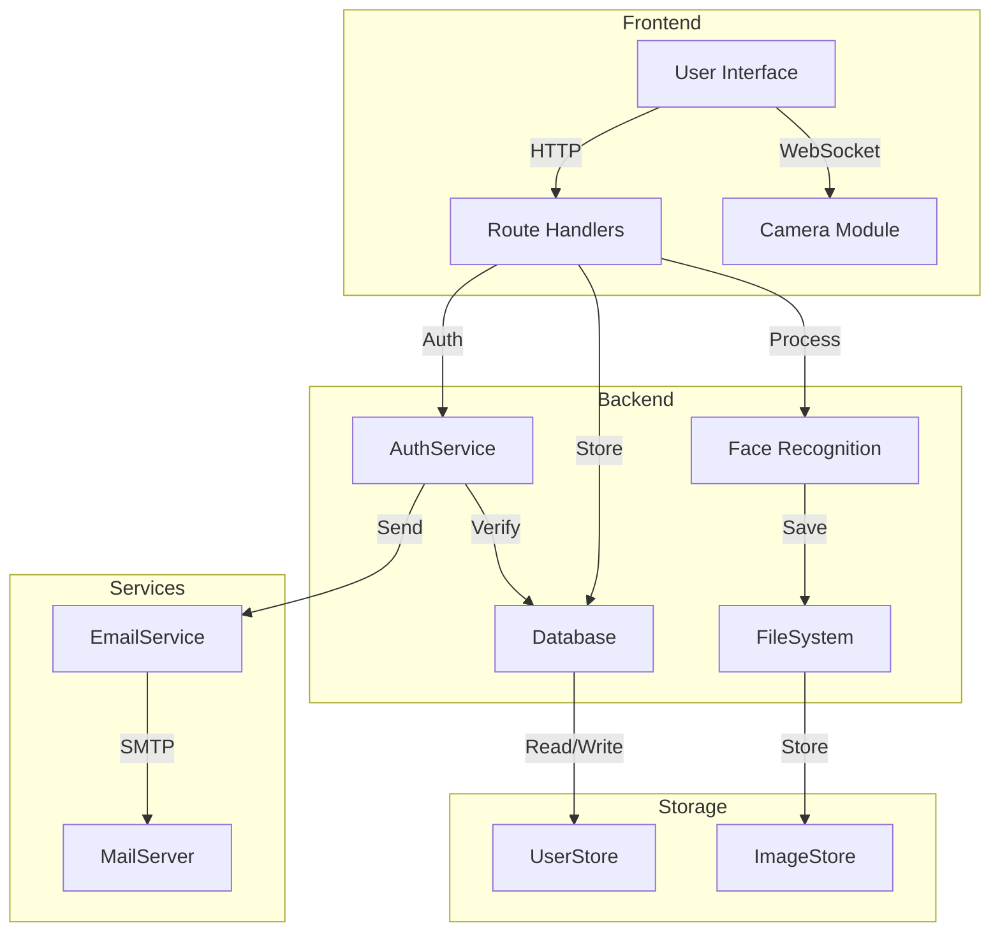
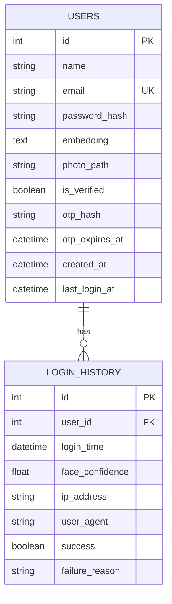
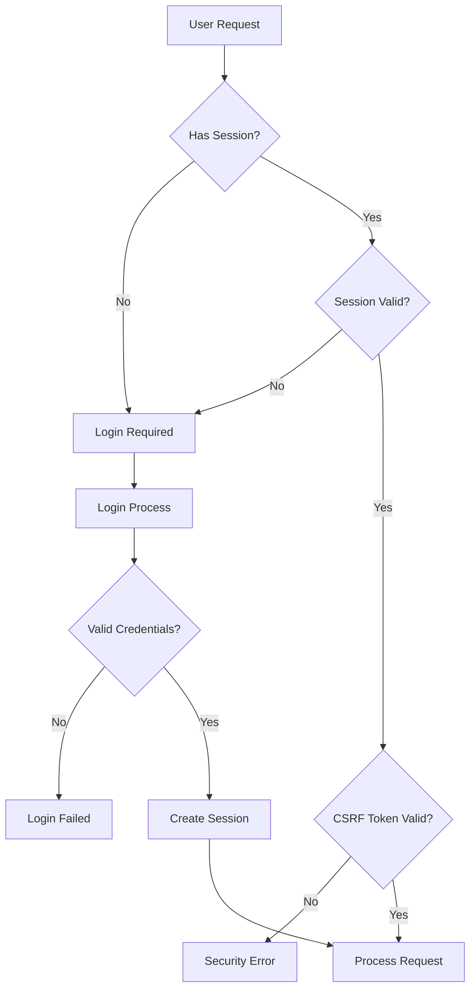

# Face Authentication System Documentation

## Table of Contents
1. [Project Overview](#project-overview)
2. [System Architecture](#system-architecture)
3. [System Flow Diagrams](#system-flow-diagrams)
4. [Features](#features)
5. [Technology Stack](#technology-stack)
6. [File Structure](#file-structure)
7. [Setup and Installation](#setup-and-installation)
8. [API Documentation](#api-documentation)
9. [Security Features](#security-features)
10. [Database Schema](#database-schema)
11. [Environmental Variables](#environmental-variables)

## Project Overview

The Face Authentication System is a secure web application that implements facial recognition for user authentication. It provides a modern, biometric approach to user verification while maintaining high security standards through multi-factor authentication.

## System Architecture



The system follows a modular architecture with the following main components:

1. **Web Interface** - Flask-based web application
2. **Authentication Service** - Handles user verification and session management
3. **Face Recognition Engine** - Processes and compares facial biometrics
4. **Email Service** - Handles all email communications
5. **Database Layer** - Manages user data and login history
6. **File Storage** - Manages uploaded face images

## System Flow Diagrams

### Registration Flow



### Login Flow



### Component Architecture



### Database Schema Diagram



### Security Flow



## Features

### Core Features
- Face-based authentication
- Email verification with OTP
- Secure user registration
- Login history tracking
- Account management
- Security reporting

### Security Features
- Multi-factor authentication (Face + OTP)
- CSRF protection
- Secure password hashing
- Session management
- IP tracking and suspicious activity monitoring
- Email notifications for login attempts

## Technology Stack

- **Backend Framework**: Flask (Python)
- **Database**: SQLAlchemy with SQLite
- **Face Recognition**: facenet-pytorch, OpenCV
- **Frontend**: HTML, CSS, JavaScript
- **Email Service**: SMTP (Gmail)
- **Security**: bcrypt, Flask-WTF
- **File Storage**: Local filesystem

## File Structure

```
FaceAuth/
├── app.py              # Main application file
├── auth.py             # Authentication logic
├── email_service.py    # Email functionality
├── face_recognition.py # Face recognition logic
├── models.py          # Database models
├── requirements.txt   # Python dependencies
├── .env              # Environment variables
├── static/           # Static files
│   ├── css/         # Stylesheets
│   ├── js/          # JavaScript files
│   └── uploads/     # User uploads
└── templates/        # HTML templates
```

## Setup and Installation

1. **Clone the Repository**
```bash
git clone [repository-url]
cd FaceAuth
```

2. **Create Virtual Environment**
```bash
python -m venv venv
source venv/bin/activate  # Linux/Mac
venv\Scripts\activate     # Windows
```

3. **Install Dependencies**
```bash
pip install -r requirements.txt
```

4. **Configure Environment Variables**
Create a `.env` file with the following variables:
```
SECRET_KEY=your-secret-key
FLASK_ENV=development
DATABASE_URL=sqlite:///face_auth.db
SMTP_SERVER=smtp.gmail.com
SMTP_PORT=587
SMTP_USERNAME=your-email@gmail.com
SMTP_PASSWORD=your-app-password
FROM_EMAIL=your-email@gmail.com
FACE_THRESHOLD=0.6
UPLOAD_FOLDER=static/uploads
OTP_EXPIRY_MINUTES=10
```

5. **Initialize Database**
```bash
flask db upgrade
```

6. **Run the Application**
```bash
python app.py
```

## API Documentation

### Authentication Endpoints

#### 1. User Registration
- **Endpoint**: `/signup`
- **Method**: POST
- **Parameters**:
  - name (string)
  - email (string)
  - password (string)
  - face_image (base64)
- **Response**: JSON with registration status

#### 2. User Login
- **Endpoint**: `/login`
- **Method**: POST
- **Parameters**:
  - email (string)
  - face_image (base64)
- **Response**: JSON with authentication status

#### 3. OTP Verification
- **Endpoint**: `/verify-otp`
- **Method**: POST
- **Parameters**:
  - user_id (integer)
  - otp (string)
- **Response**: JSON with verification status

## Security Features

1. **Face Recognition Security**
   - Face embedding comparison using cosine similarity
   - Customizable similarity threshold
   - Multiple face detection prevention

2. **Authentication Security**
   - Password hashing using bcrypt
   - OTP verification for registration
   - Session management
   - CSRF protection

3. **Login Security**
   - IP address tracking
   - User agent logging
   - Login attempt history
   - Suspicious activity detection

## Database Schema

### Users Table
```sql
CREATE TABLE users (
    id INTEGER PRIMARY KEY,
    name VARCHAR(100) NOT NULL,
    email VARCHAR(120) UNIQUE NOT NULL,
    password_hash VARCHAR(255) NOT NULL,
    embedding TEXT,
    photo_path VARCHAR(255),
    is_verified BOOLEAN DEFAULT FALSE,
    otp_hash VARCHAR(255),
    otp_expires_at DATETIME,
    created_at DATETIME DEFAULT CURRENT_TIMESTAMP,
    last_login_at DATETIME
);
```

### Login History Table
```sql
CREATE TABLE login_history (
    id INTEGER PRIMARY KEY,
    user_id INTEGER NOT NULL,
    login_time DATETIME NOT NULL DEFAULT CURRENT_TIMESTAMP,
    face_confidence FLOAT,
    ip_address VARCHAR(45),
    user_agent VARCHAR(255),
    success BOOLEAN NOT NULL DEFAULT TRUE,
    failure_reason VARCHAR(255),
    FOREIGN KEY (user_id) REFERENCES users(id)
);
```

## Environmental Variables

| Variable | Description | Default Value |
|----------|-------------|---------------|
| SECRET_KEY | Flask secret key | Required |
| FLASK_ENV | Environment mode | development |
| DATABASE_URL | Database connection URL | sqlite:///face_auth.db |
| SMTP_SERVER | Email server address | smtp.gmail.com |
| SMTP_PORT | Email server port | 587 |
| SMTP_USERNAME | Email account username | Required |
| SMTP_PASSWORD | Email account password | Required |
| FROM_EMAIL | Sender email address | Required |
| FACE_THRESHOLD | Face similarity threshold | 0.6 |
| UPLOAD_FOLDER | Path for uploaded files | static/uploads |
| OTP_EXPIRY_MINUTES | OTP validity duration | 10 |

## Error Handling

The application implements comprehensive error handling for:
- Authentication failures
- Face detection issues
- Email sending failures
- Database errors
- File upload problems
- Invalid requests

## Security Best Practices

1. **Password Security**
   - Secure hashing with bcrypt
   - Minimum length enforcement
   - Complexity requirements

2. **Face Recognition Security**
   - Multiple face detection prevention
   - Adjustable similarity threshold
   - Base64 image validation

3. **Session Security**
   - Secure session configuration
   - CSRF protection
   - Session timeout handling

4. **Email Security**
   - TLS encryption
   - OTP expiration
   - Secure email templates

## Maintenance and Monitoring

1. **Login Monitoring**
   - Failed attempt tracking
   - IP address logging
   - User agent tracking

2. **System Maintenance**
   - Regular database cleanup
   - File storage management
   - Session cleanup

3. **Security Monitoring**
   - Suspicious activity detection
   - Login pattern analysis
   - Error logging and monitoring