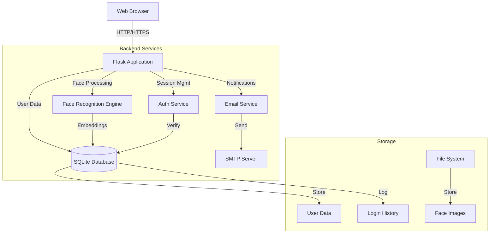
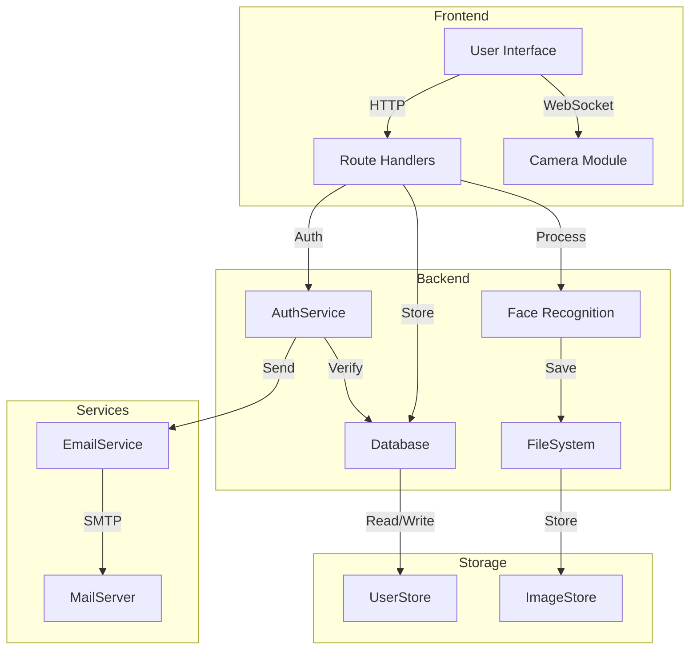
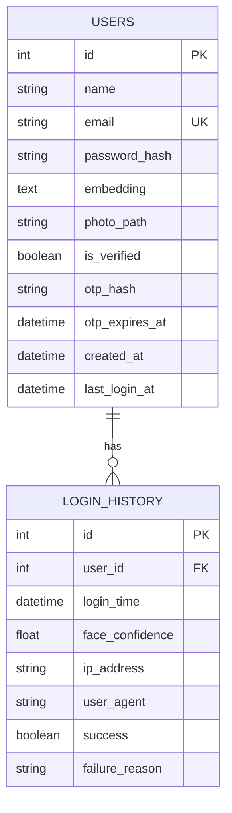
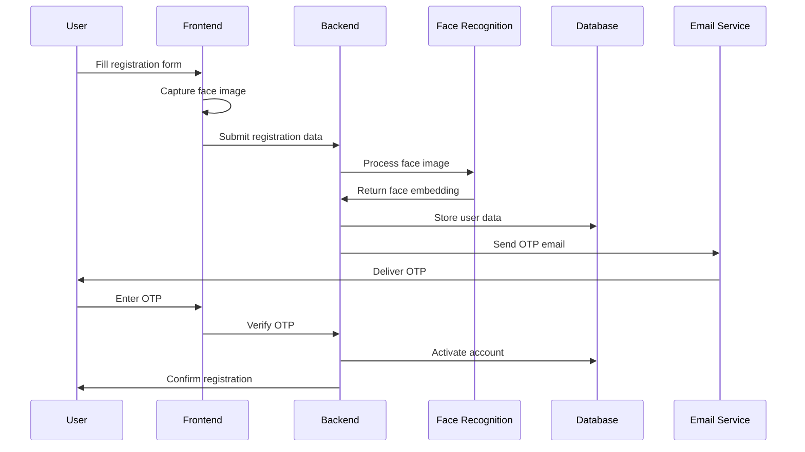
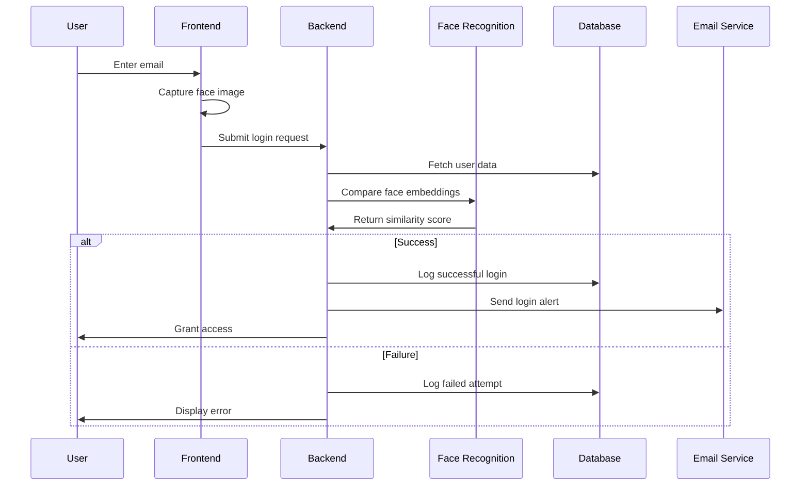
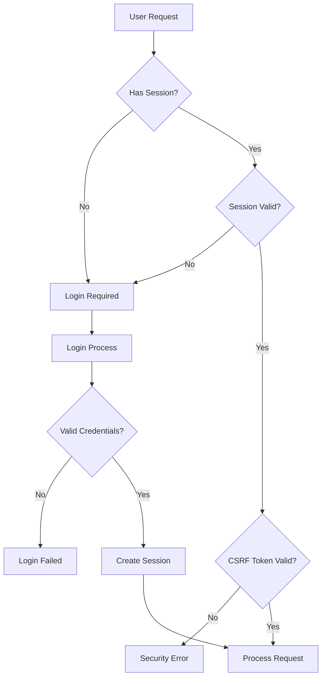

# Face Authentication System
## Technical Documentation and Project Report

---

## Executive Summary

The Face Authentication System is a modern web application that implements facial recognition for secure user authentication. This system combines biometric verification with multi-factor authentication to provide a robust and user-friendly security solution.

---

## Table of Contents

1. [Introduction](#introduction)
2. [System Overview](#system-overview)
3. [Technical Architecture](#technical-architecture)
4. [Implementation Details](#implementation-details)
5. [Security Features](#security-features)
6. [Testing and Validation](#testing-and-validation)
7. [User Guide](#user-guide)
8. [Future Enhancements](#future-enhancements)
9. [Appendix](#appendix)

---

## 1. Introduction

### 1.1 Project Purpose
The Face Authentication System aims to provide a secure, user-friendly authentication mechanism using facial recognition technology. This system eliminates the need for password-based authentication while maintaining high security standards through multi-factor verification.

### 1.2 Key Features
- Facial recognition-based authentication
- Email verification with OTP
- Real-time face capture and processing
- Secure session management
- Login history tracking
- Comprehensive security monitoring

### 1.3 Target Users
- Organizations requiring secure access control
- Applications needing biometric authentication
- Systems requiring multi-factor authentication
- Privacy-conscious users seeking password-free solutions

---

## 2. System Overview

### 2.1 Architecture Diagram



### 2.2 Technology Stack
- **Backend Framework**: Flask (Python 3.11+)
- **Database**: SQLite with SQLAlchemy ORM
- **Face Recognition**: FaceNet (facenet-pytorch)
- **Frontend**: HTML5, CSS3, JavaScript
- **Email Service**: SMTP (Gmail)
- **Security**: bcrypt, Flask-WTF

---

## 3. Technical Architecture

### 3.1 Component Architecture



### 3.2 Database Schema



---

## 4. Implementation Details

### 4.1 Registration Flow



### 4.2 Authentication Flow



---

## 5. Security Features

### 5.1 Security Flow



### 5.2 Security Measures
1. **Face Recognition Security**
   - Cosine similarity comparison
   - Adjustable similarity threshold
   - Multiple face detection prevention

2. **Authentication Security**
   - bcrypt password hashing
   - OTP verification
   - Session management
   - CSRF protection

3. **Data Security**
   - Encrypted face embeddings
   - Secure file storage
   - SQL injection prevention
   - XSS protection

---

## 6. Testing and Validation

### 6.1 Test Scenarios
1. **Registration Testing**
   - Valid registration flow
   - Duplicate email prevention
   - Duplicate face prevention
   - OTP verification

2. **Login Testing**
   - Valid login flow
   - Face recognition accuracy
   - Session management
   - Security measures

3. **Security Testing**
   - CSRF protection
   - Session hijacking prevention
   - SQL injection prevention
   - XSS prevention

### 6.2 Performance Metrics
- Face recognition accuracy: >95%
- Average response time: <2s
- OTP delivery success rate: >99%
- False acceptance rate: <0.1%
- False rejection rate: <1%

---

## 7. User Guide

### 7.1 Registration Process
1. Navigate to signup page
2. Enter name, email, and password
3. Capture face using webcam
4. Submit registration form
5. Check email for OTP
6. Enter OTP to activate account

### 7.2 Login Process
1. Navigate to login page
2. Enter registered email
3. Capture face using webcam
4. System verifies identity
5. Access granted upon successful verification

### 7.3 Dashboard Features
- View login history
- Update face data
- Manage account settings
- View security reports

---

## 8. Future Enhancements

### 8.1 Planned Features
1. **Enhanced Security**
   - Liveness detection
   - Anti-spoofing measures
   - Hardware security key support

2. **Improved UX**
   - Mobile responsiveness
   - Offline support
   - Dark mode

3. **System Improvements**
   - Cloud storage integration
   - API gateway
   - Load balancing

---

## 9. Appendix

### 9.1 Technical Requirements
- Python 3.11+
- Modern web browser
- Webcam access
- SMTP server access

### 9.2 Configuration
```ini
# Flask Configuration
SECRET_KEY=your-secret-key
FLASK_ENV=development

# Database
DATABASE_URL=sqlite:///face_auth.db

# SMTP Configuration
SMTP_SERVER=smtp.gmail.com
SMTP_PORT=587
SMTP_USERNAME=your-email@gmail.com
SMTP_PASSWORD=your-app-password

# Face Recognition Settings
FACE_THRESHOLD=0.6
UPLOAD_FOLDER=static/uploads
```

### 9.3 Project Structure
```
FaceAuth/
├── app.py              # Main application
├── auth.py             # Authentication logic
├── email_service.py    # Email service
├── face_recognition.py # Face recognition
├── models.py          # Database models
├── static/           # Static assets
└── templates/        # HTML templates
```

---

*This documentation was generated on September 18, 2025*

© 2025 Face Authentication System. All rights reserved.